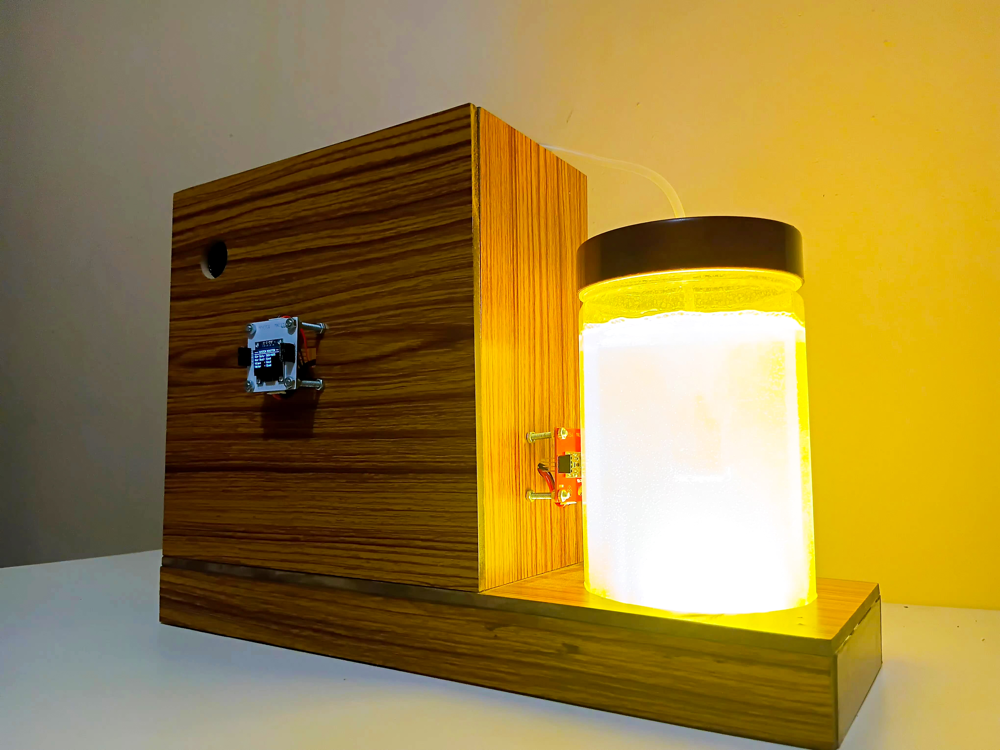

<p align="center">
  
</p>

# Introduction

SmartBio Air is an intelligent indoor air purification and environmental research system powered by:

* Living microalgae
* IoT sensors
* Edge AI
* Cloud AI services

The system purifies indoor air while continuously studying how algae react to environmental conditions such as:

* Air pollution
* Temperature
* Light intensity
* Gas concentration

Unlike traditional air purifiers, SmartBio Air combines biological purification with AI-driven monitoring and autonomous control.

---

# Why This Project?

Indoor air pollution has become a serious health concern.

Traditional air purifiers:

* Only filter particles
* Consume high power
* Require filter replacement
* Cannot study environmental behavior

Microalgae offer a natural alternative because they:

* Absorb CO₂
* Release oxygen
* Support biological air treatment

SmartBio Air uses algae together with AI and IoT technology to create a smarter and safer purification system.

---

<p align="center">
  
</p>

---

# Problem Statement

Existing algae-based purification systems face several limitations:

* No continuous monitoring
* No autonomous control
* Dependence on cloud connectivity
* Lack of safety monitoring
* Limited real-world usability

There is a need for a system that can:

* Operate safely indoors
* Work even without internet
* Monitor environmental conditions continuously
* Support long-term research and analysis

---

# Project Objectives

The main goals of SmartBio Air are:

✅ Create an algae-based indoor air purifier

✅ Monitor indoor environmental conditions

✅ Use Edge AI for autonomous operation

✅ Detect motor faults using TinyML

✅ Study algae behavior under changing pollution conditions

✅ Support long-term data collection and visualization

---

# Proposed Solution

SmartBio Air combines:

* Living algae chamber
* Multi-sensor monitoring
* Edge AI safety system
* Cloud AI analytics

The system operates in two intelligent modes:

---

## 1. Edge Control Mode

This mode runs directly on the MYOSA Mini IoT Kit.

### Functions

* Air quality monitoring
* Motor pump protection
* Autonomous execution
* Real-time response
* Offline operation

### Advantages

* Works without internet
* Fast response time
* Hardware safety protection
* Continuous purification

---

## 2. Cloud AI Research Mode

This mode activates when internet connectivity is available.

### Functions

* Upload sensor data
* Store environmental records
* AI-based data analysis
* Long-term observation
* Dashboard visualization

### Advantages

* Research support
* Pattern analysis
* Environmental correlation
* Biological observation

---

<p align="center">
  
</p>

---

# Complete Working Process

# 🔹 Step 1 — Environmental Monitoring

The system continuously monitors indoor conditions using multiple sensors.

### Sensors Used

| Sensor   | Purpose                   |
| -------- | ------------------------- |
| MQ-2     | Smoke detection           |
| MQ-3     | Alcohol gas detection     |
| MQ-7     | Carbon monoxide detection |
| MQ-135   | Air quality monitoring    |
| BMP180   | Temperature & pressure    |
| APDS9960 | Light sensing             |
| MPU6050  | Vibration monitoring      |

### Process

1. Sensors collect real-time environmental data
2. Data is sent to the ESP32 controller
3. Air quality levels are evaluated continuously

---

# 🔹 Step 2 — Algae-Based Air Purification

The algae chamber acts as the biological purification component.

### Working

* Air passes through the algae chamber
* Algae absorb carbon dioxide
* Oxygen release supports cleaner air
* Grow LEDs maintain algae activity

### Benefits

✅ Natural purification
✅ Eco-friendly operation
✅ Biological air treatment
✅ Sustainable design

---

# 🔹 Step 3 — Edge AI Safety Control

Safety-critical operations run directly on the device using Edge AI.

### TinyML Motor Monitoring

The MPU6050 sensor captures motor vibration data.

TinyML models classify:

* Normal motor condition
* Abnormal vibration
* Potential motor failure

### Actions Taken

If abnormal behavior is detected:

* The system can stop the motor
* Prevent overheating
* Protect hardware components

### Advantages

✅ Offline execution
✅ Fast response
✅ Hardware protection
✅ Reduced failure risk

---

# 🔹 Step 4 — Autonomous System Operation

The MYOSA ESP32 controller manages:

* Sensor reading
* Motor control
* Relay switching
* OLED display updates
* AI inference execution

The system continues operating even during:

* Network failure
* Cloud unavailability
* Internet disconnection

---

# 🔹 Step 5 — Cloud AI Analysis

When internet is available:

1. Sensor data is uploaded to cloud services
2. Environmental records are stored
3. AI agents analyze patterns
4. Long-term observations are generated

### Cloud Features

* Environmental trend analysis
* Pollution pattern observation
* Algae growth correlation
* Web dashboard visualization

---

# System Workflow

<p align="center">
  
</p>

---

# Prototype Design

<p align="center">
  
</p>

---

# Web Dashboard

<p align="center">
  
</p>

---

# Main Features

✅ Algae-assisted air purification

✅ Multi-gas environmental sensing

✅ TinyML motor fault detection

✅ Autonomous offline operation

✅ Cloud AI environmental analysis

✅ OLED status display

✅ Web dashboard monitoring

✅ Real-time sensor monitoring

✅ Edge AI safety execution

✅ Research-oriented architecture

---

# Tech Stack

# Hardware

* MYOSA Motherboard (ESP32)
* MPU6050
* APDS9960
* BMP180
* SSD1306 OLED
* L298N Motor Driver
* MQ-2
* MQ-3
* MQ-7
* MQ-135
* Relay Board
* DC Air Pump
* Plant Grow LED

---

# Software & Cloud

| Technology      | Usage                |
| --------------- | -------------------- |
| Arduino IDE        | Firmware development |
| Edge Impulse    | TinyML inference     |
| Azure Functions | Cloud backend        |
| Azure OpenAI    | AI analysis          |
| HTML/CSS/JS     | Web dashboard        |

---

# Project Outcomes

✅ Functional algae-based indoor air purifier

✅ Continuous environmental monitoring

✅ Autonomous Edge AI execution

✅ Pollution and algae growth dataset

✅ TinyML research platform

✅ IoT-based environmental monitoring system

✅ Cloud-connected research workflow

---

# Installation

## Clone Repository

```bash id="4lmq7x"
git clone https://github.com/PlatoonX/SmartBio-Air.git
```

---

## Run Web Dashboard

Open:

```bash id="xk3m1v"
index.html
```

in a web browser.

---

## Requirements — What you need to reproduce or extend this project

The following checklist highlights the practical items, accounts, data, and skills recommended to build, run, or extend SmartBio Air. This section complements the hardware and software summaries above without repeating them verbatim.

- Hardware (minimum): a Wi‑Fi capable microcontroller (MYOSA Mini / ESP32), a low‑voltage DC air pump and fan, a transparent algae chamber or container, basic environmental sensors (gas sensor(s), temperature/humidity), an IMU (MPU6050 or equivalent) for vibration, a small OLED or other status display, relays or MOSFETs for actuator control, and a reliable power supply.
- Software & accounts: Arduino IDE (or PlatformIO), an Edge Impulse account for TinyML dataset/model work (optional but recommended), and an optional cloud account (Azure, or your choice) for long‑term logging and dashboard hosting.
- Data & models: the project includes example datasets and an exported TFLite model in `tinyml_motorpumpfaultdetection/`; prepare to collect labeled vibration samples if retraining models.
- Tools & accessories: basic electronics tools (soldering iron, wire strippers, multimeter), jumper wires, tubing for pump connections, mounting hardware, and silicone sealant or gaskets for leak prevention.
- Skills & knowledge: basic Arduino/C++ firmware skills, familiarity with Edge Impulse (or TinyML workflows), comfort with simple web technologies (HTML/CSS/JS) for the dashboard, and basic data-analysis skills (Python / Jupyter recommended).
- Safety & lab considerations: handle algae cultures responsibly (avoid release), keep electrical components away from water, provide drip trays, use GFCI or protected power sources, and follow local biosafety guidance for experiments.
- Optional extras: camera for time‑lapse imaging, additional environmental sensors (CO₂ NDIR sensor, particulate matter sensor), and enclosure or cabinetry for a production prototype.


# Project Structure

```text id="3tzr9p"
SmartBio-Air/
│
├── data/
│   ├── datacollectionscript/
│   └── datasets/
│
├── tinyml_motorpumpfaultdetection/
│   ├── faultdetection_inferencing/
│   └── faultdetection_modelfile/
│
├── myosa-main/
├── agent_main/
├── webapp_main/
│
└── src/
    ├── img/
    └── gif/
```

---

# Future Scope

* Mobile application integration
* Advanced AI prediction models
* Real-time alert system
* Smart home integration
* Larger-scale algae chambers
* Industrial environmental monitoring

---

# License

This project is licensed under the MIT License.

---

# 👨‍💻 Contributors

- **Nimalan P** - [@nimalan-parameswaran](https://github.com/nimalan-parameswaran)  
- **Dhakshatha M K** - [@DhakshathaMylsamy](https://github.com/DhakshathaMylsamy)
